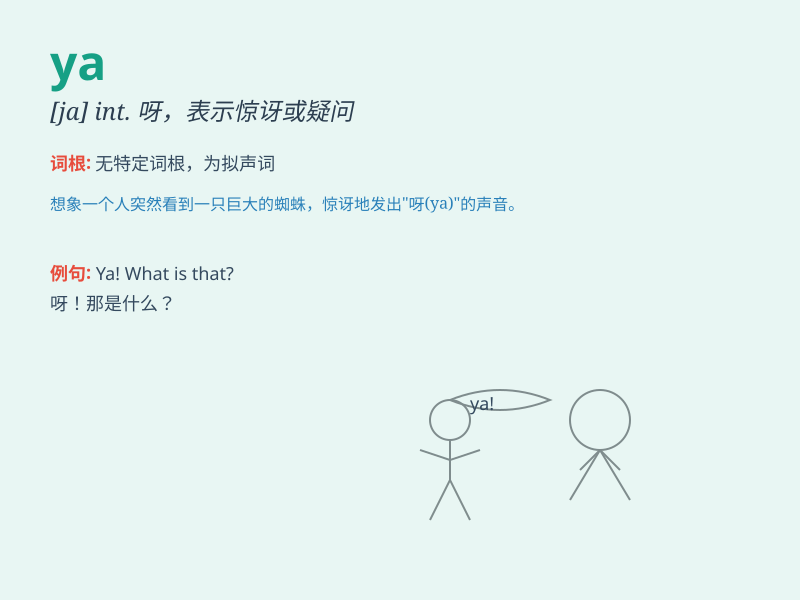

## ya

**英音:** _[jə; jæ]_ **美音:** _[jə]_

**译义:** *young adult 年轻人*

### 短语

+ **ya know:** _你知道（常用口语表达）_

+ **ya gotta:** _你得（got to 的口语化）_

+ **ya all:** _你们大家（美国南部常用）_

+ **say ya:** _说再见_

+ **come on ya:** _来吧，你_

### 例句

#### 例句1

> **Hey, ya! How have you been?**

**中文翻译:** 嘿，你呀！你过得怎么样？

**单词释义:** 你（口语化、非正式的称呼）

#### 例句2

> **Come on, ya, let\'s go!**

**中文翻译:** 来吧，你呀，咱们走！

**单词释义:** 你（表示亲密、随意的称呼）

#### 例句3

> **Ya know, I really miss the old days.**

**中文翻译:** 你知道呀，我真的很怀念过去的日子。

**单词释义:** （用于口语中，无具体实义，起强调或引起注意的作用）

### 背诵小故事

> Once upon a time, a little girl was lost and shouted \'Ya! Ya!\' to
call for help. Finally, she was found. Remember, \'ya\' can express a
cry or shout.

**从前，有个小女孩迷路了，大喊'呀！呀！'来求助。最后，她被找到了。记住，'ya'可以表示叫喊。**

### 图义

