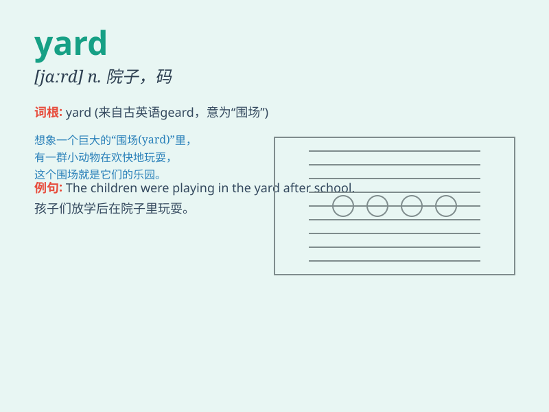

## yard

**英音:** _[jɑːd]_ **美音:** _[jɑrd]_

**译义:** *n.院子,码*

### 短语

+ **back yard:** _后院_

+ **front yard:** _前院_

+ **ship yard:** _造船厂；船坞_

+ **goods yard:** _货场_

+ **storage yard:** _堆场；仓库场_

### 例句

#### 例句1

> **The children are playing in the yard.**

**中文翻译:** 孩子们正在院子里玩耍。

**单词释义:** 院子

#### 例句2

> **A train was standing in the railway yard.**

**中文翻译:** 一列火车停在铁路调车场里。

**单词释义:** 调车场

#### 例句3

> **The workers are stacking logs in the yard.**

**中文翻译:** 工人们正在院子里堆木头。

**单词释义:** 院子

### 背诵小故事

> A little boy was lost in a big yard. He looked around and saw many
flowers and a dog playing. He finally found the exit when he followed
the fence of the yard.

**一个小男孩在一个大院子里迷路了。他环顾四周，看到许多花和一只狗在玩耍。当他沿着院子的围栏走时，终于找到了出口。**

### 图义

