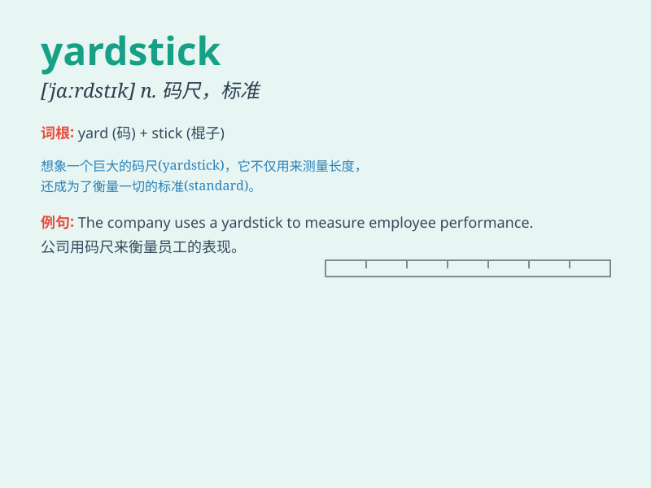

## yardstick

**英音:** _[\'jɑːdstɪk]_ **美音:** _[\'jɑrd\'stɪk]_

**译义:** *n.\<美> 码尺,准绳*

### 短语

+ **set a yardstick:** _设定标准_

+ **use a yardstick:** _使用标准_

+ **yardstick measurement:** _标准测量_

+ **fair yardstick:** _公平的标准_

+ **established yardstick:** _既定的标准_

### 例句

#### 例句1

> **The new law will be the yardstick against which all future
policies are measured.**

**中文翻译:** 新法律将成为衡量未来所有政策的标准。

**单词释义:** 标准；尺度

#### 例句2

> **We need a yardstick to evaluate the performance of our
employees.**

**中文翻译:** 我们需要一个标准来评估员工的表现。

**单词释义:** 衡量标准

#### 例句3

> **Quality of service is often the yardstick by which customers
choose a company.**

**中文翻译:** 服务质量往往是客户选择公司的标准。

**单词释义:** 标准；准绳

### 背诵小故事

> A carpenter was making furniture. He needed a yardstick to measure
the wood precisely. With the yardstick, he could ensure each piece was
the right size. So, the yardstick became his trusted tool.

**一位木匠正在制作家具。他需要一把码尺来精确测量木材。有了码尺，他能确保每一块木材的尺寸都合适。所以，码尺成了他信赖的工具。**

### 图义

