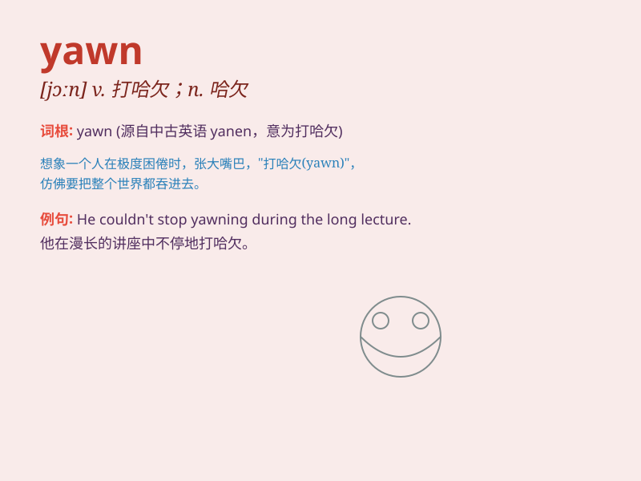

## yawn

**英音:** _[jɔːn]_ **美音:** _[jɔn]_

**译义:** *v.打呵欠,张开,裂开n.呵欠*

### 短语

+ **yawn widely:** _大大地打哈欠_

+ **yawn sleepily:** _困倦地打哈欠_

+ **yawn uncontrollably:** _无法控制地打哈欠_

+ **yawn repeatedly:** _反复打哈欠_

+ **yawn openly:** _公然打哈欠_

### 例句

#### 例句1

> **He yawned loudly during the boring meeting.**

**中文翻译:** 在无聊的会议期间，他大声打了个哈欠。

**单词释义:** 打哈欠

#### 例句2

> **The long journey made her yawn constantly.**

**中文翻译:** 漫长的旅途使她不停地打哈欠。

**单词释义:** 打哈欠

#### 例句3

> **She covered her mouth when she yawned to be polite.**

**中文翻译:** 她打哈欠时捂住嘴以示礼貌。

**单词释义:** 打哈欠

### 背诵小故事

> One night, when Tom was reading a boring book, he couldn\'t help but
yawn. His mouth opened wide as he felt extremely sleepy. Just then, a
magical fairy appeared and said, \'Your yawn shows it\'s time for bed!\'

**一天晚上，当汤姆在读一本无聊的书时，他忍不住打了个哈欠。他的嘴张得大大的，因为他感到极其困倦。就在这时，一个神奇的仙女出现了，并说：'你的哈欠表明该睡觉了！'**

### 图义

