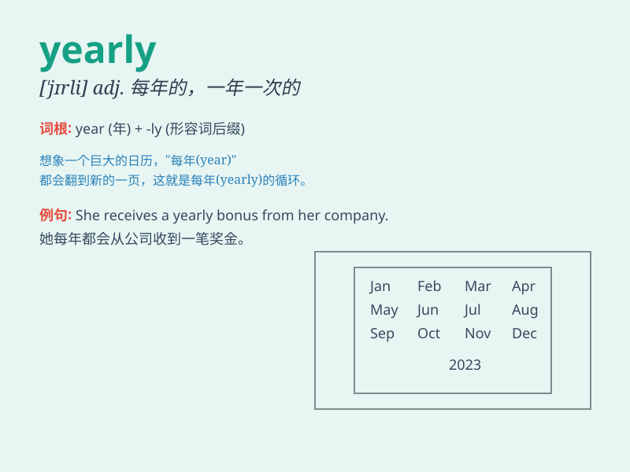

## yearly

**英音:** _[\'jɪəlɪ; \'jɜː-]_ **美音:** _[\'jɪrli]_

**译义:** *adj.每年的;adv.每年*

### 短语

+ **yearly income:** _年收入_

+ **yearly report:** _年度报告_

+ **yearly growth:** _年增长_

+ **yearly budget:** _年度预算_

+ **yearly review:** _年度审查_

### 例句

#### 例句1

> **The company conducts a yearly performance review of its
employees.**

**中文翻译:** 公司每年对员工进行一次绩效评估。

**单词释义:** 每年的

#### 例句2

> **We have a yearly family reunion during the summer vacation.**

**中文翻译:** 我们在暑假期间有一年一度的家庭团聚。

**单词释义:** 每年的

#### 例句3

> **The magazine is published yearly.**

**中文翻译:** 这本杂志每年出版一次。

**单词释义:** 每年

### 背诵小故事

> A little rabbit decided to plant carrots yearly. Every year, it
carefully prepared the soil and sowed the seeds. With its hard work, it
always had a bountiful harvest. Yearly means happening once every year.

**一只小兔子决定每年都种胡萝卜。每年，它都认真准备土壤并播种。通过努力，它每年都有大丰收。yearly
意思是每年发生一次。**

### 图义

