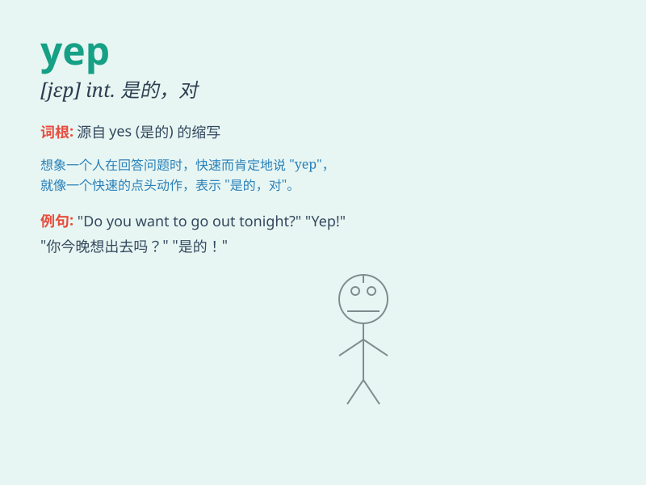

## yep

**英音:** _[jep]_ **美音:** _[jɛp]_

**译义:** *adv.\<俚>是*

### 短语

+ **yep sure:** _是的，当然_

+ **yep indeed:** _是的，确实_

+ **yep right:** _是的，没错_

+ **yep okay:** _是的，好的_

+ **yep all right:** _是的，行_

### 例句

#### 例句1

> **A: Do you want to go to the movies tonight? B: Yep, that sounds
great!**

**中文翻译:** A: 你今晚想去看电影吗？ B: 是的，听起来很棒！

**单词释义:** 表示同意或肯定

#### 例句2

> **I asked if he was ready, and he said, \'Yep.\'**

**中文翻译:** 我问他是否准备好了，他说："是的。"

**单词释义:** 表示肯定的回答

#### 例句3

> **Yep, I\'ve finished my homework.**

**中文翻译:** 是的，我已经完成了我的作业。

**单词释义:** 表示确认完成某事

### 背诵小故事

>
有一天，小明在课堂上回答老师的问题，老师问他是否明白了，他自信地大声说\'Yep
\'，意思就是\'是的\'。老师对他的积极回应很满意。

**有一天，小明在课堂回答老师问题时自信地用\'Yep
\'表示\'是的\'，老师很满意。**

### 图义

