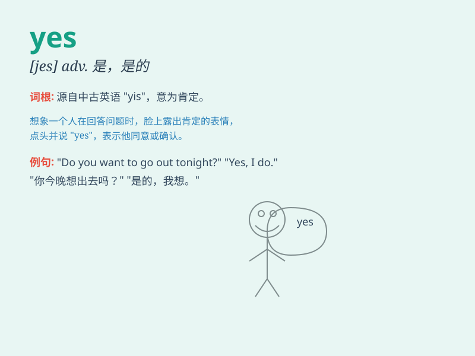

## yes

**英音:** _[jes]_ **美音:** _[jɛs]_

**译义:** *adv.n.是*

### 短语

+ **yes and no:** _既是又不是；既肯定又否定_

+ **yes-man:** _唯唯诺诺的人；应声虫_

+ **say yes:** _同意；答应_

+ **yes or no:** _是或不是；是与否_

+ **a resounding yes:** _响亮的肯定回答_

### 例句

#### 例句1

> **Yes, I understand.**

**中文翻译:** 是的，我明白。

**单词释义:** 表示同意、肯定

#### 例句2

> **Will you come? Yes, I will.**

**中文翻译:** 你会来吗？是的，我会。

**单词释义:** 回答一般疑问句，表示肯定

#### 例句3

> **Yes, it\'s a beautiful day.**

**中文翻译:** 是的，这是美好的一天。

**单词释义:** 表示赞同前面的陈述

### 背诵小故事

> A little boy was asked if he wanted to go to the park. He shouted
\'Yes\' excitedly because he loved playing on the swings there. It was a
simple word that showed his eagerness and agreement.

**一个小男孩被问到是否想去公园。他兴奋地大喊\'Yes\'，因为他喜欢在那里荡秋千。这个简单的单词表明了他的渴望和同意。**

### 图义

