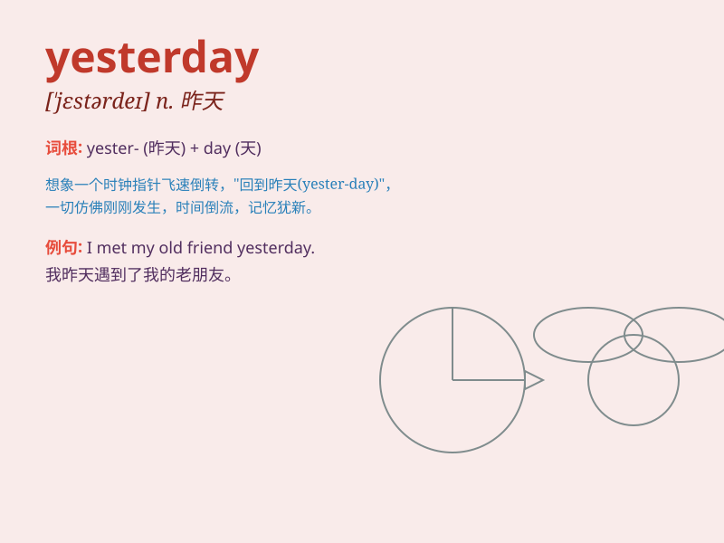

## yesterday

**英音:** _[ˈjestədɪ;-deɪ]_ **美音:** _[ˈjɛstɚdɪ;-de]_

**译义:** *n.昨天adv.昨天*

### 短语

+ **yesterday morning:** _昨天早上_

+ **yesterday evening:** _昨天晚上_

+ **yesterday afternoon:** _昨天下午_

+ **the day before yesterday:** _前天_

+ **yesterday once more:** _昨日重现_

### 例句

#### 例句1

> **I went to the park yesterday.**

**中文翻译:** 我昨天去了公园。

**单词释义:** 昨天

#### 例句2

> **She finished her homework yesterday evening.**

**中文翻译:** 她昨天晚上完成了作业。

**单词释义:** 昨天

#### 例句3

> **We had a great party yesterday.**

**中文翻译:** 我们昨天举办了一场很棒的派对。

**单词释义:** 昨天

### 背诵小故事

> A little mouse was very happy yesterday. It found a big piece of
cheese and had a wonderful feast. But today, it has to look for new
food. Remember, yesterday was a special day for the mouse.

**一只小老鼠昨天非常开心。它找到了一大块奶酪，并享用了一顿美餐。但今天，它得去寻找新的食物。记住，昨天对于老鼠来说是特别的一天。**

### 图义

