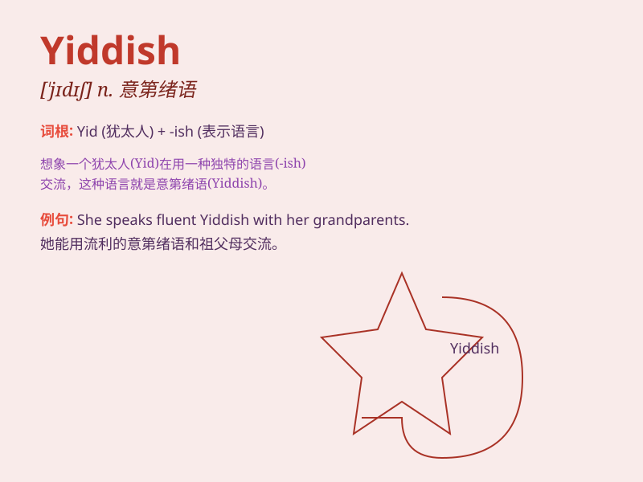

## Yiddish

**英音:** _[ˈjɪdɪʃ]_ **美音:** _[ˈjɪdɪʃ]_

**译义:** *n.依地语（犹太人使用的国际语）*

### 短语

+ **Yiddish language:** _意第绪语_

+ **Yiddish literature:** _意第绪文学_

+ **Yiddish theater:** _意第绪剧院_

+ **Yiddish music:** _意第绪音乐_

+ **Yiddish culture:** _意第绪文化_

### 例句

#### 例句1

> **He is fluent in Yiddish.**

**中文翻译:** 他说意第绪语很流利。

**单词释义:** 意第绪语

#### 例句2

> **The book was written in Yiddish and later translated into several
languages.**

**中文翻译:** 这本书是用意第绪语写的，后来被翻译成了几种语言。

**单词释义:** 意第绪语

#### 例句3

> **She learned Yiddish to connect with her heritage.**

**中文翻译:** 她学习意第绪语以与她的传统相联系。

**单词释义:** 意第绪语

### 背诵小故事

> 想象一下，有个叫小明的人去旅行，在一个神秘的小镇上遇到一位会说
Yiddish 语的老人。老人用 Yiddish
给他讲述了很多有趣的故事。小明被这种独特的语言吸引，决定学习它。

**想象一下，有个人在旅行中遇到会说依地语（Yiddish）的老人，老人讲故事吸引人去学习这种语言。**

### 图义

