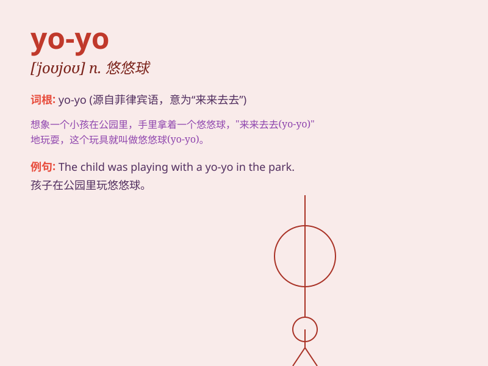

## yo-yo

**英音:** _[ˈjəʊ jəʊ]_ **美音:** _[ˈjoʊ joʊ]_

**译义:** *n. 溜溜球（一种玩具）；vi. 上下或来回移动；波动*

### 短语

+ **play with a yo-yo:** _玩溜溜球_

+ **yo-yo diet:** _溜溜球式减肥_

+ **yo-yo effect:** _溜溜球效应_

+ **yo-yo trick:** _溜溜球技巧_

+ **yo-yo competition:** _溜溜球比赛_

### 例句

#### 例句1

> **I used to play with a yo-yo when I was a kid.**

**中文翻译:** 我小时候经常玩溜溜球。

**单词释义:** 溜溜球

#### 例句2

> **The yo-yo kept going up and down.**

**中文翻译:** 这个溜溜球不停地上下移动。

**单词释义:** 溜溜球

#### 例句3

> **He is very good at doing tricks with a yo-yo.**

**中文翻译:** 他很擅长用溜溜球玩花样。

**单词释义:** 溜溜球

### 背诵小故事

> Once upon a time, there was a little boy who loved playing with a
yo-yo. Every day, he would show off his tricks with the yo-yo to his
friends. The yo-yo went up and down, just like his happy mood.

**从前，有个小男孩喜欢玩溜溜球。每天，他都会向朋友们展示他玩溜溜球的技巧。溜溜球上下移动，就像他快乐的心情。**

### 图义

