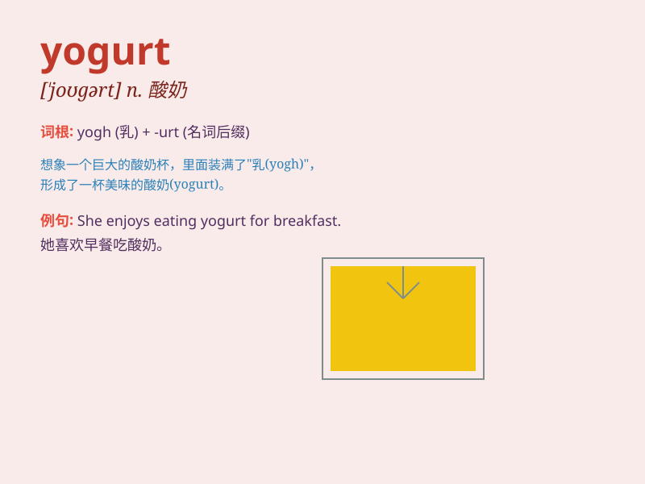

## yogurt

**英音:** _[\'jɒgət; \'jəʊ-]_ **美音:** _[\'joɡət]_

**译义:** *n.(=yoghurt) 酸奶酪,酵母乳*

### 短语

+ **plain yogurt:** _原味酸奶_

+ **fruit yogurt:** _水果酸奶_

+ **low-fat yogurt:** _低脂酸奶_

+ **yogurt drink:** _酸奶饮料_

+ **homemade yogurt:** _自制酸奶_

### 例句

#### 例句1

> **I like to have yogurt for breakfast.**

**中文翻译:** 我喜欢早餐吃酸奶。

**单词释义:** 酸奶

#### 例句2

> **The yogurt in this shop is very delicious.**

**中文翻译:** 这家店的酸奶非常美味。

**单词释义:** 酸奶

#### 例句3

> **She made some fruit salad with yogurt.**

**中文翻译:** 她用酸奶做了一些水果沙拉。

**单词释义:** 酸奶

### 背诵小故事

> A little girl named Lily loved yogurt. Every day after school, she
would run to the fridge and enjoy a cup of sweet yogurt. It made her
happy and gave her energy. So, whenever she thought of yogurt, she
remembered her happy moments.

**一个叫莉莉的小女孩喜欢酸奶。每天放学后，她都会跑到冰箱前享用一杯甜甜的酸奶。这让她开心并给她能量。所以，每当她想到酸奶，就会想起那些快乐的时刻。**

### 图义

