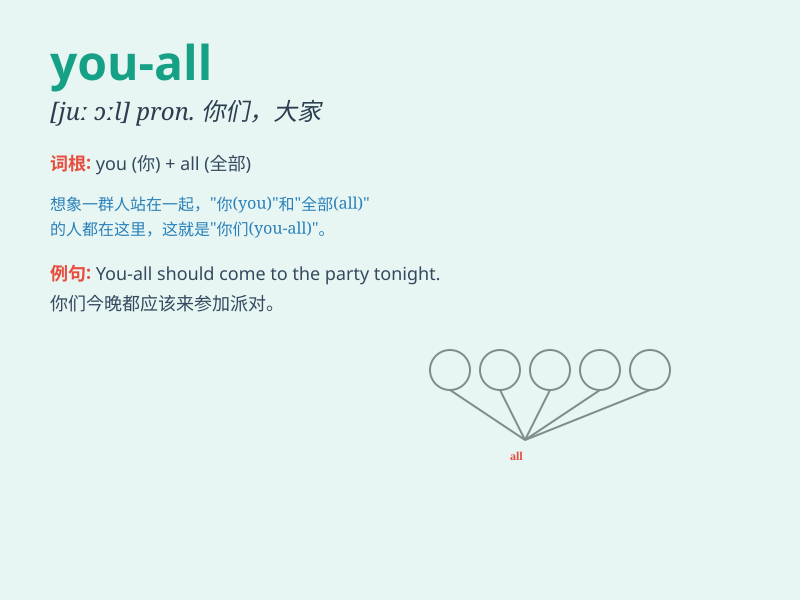

## you-all

**英音:** _[juː ɔːl]_ **美音:** _[ju ɔl]_

**译义:** *pron.
你们（you的复数形式，用于非正式场合，特别是在美国南部英语中）*

### 短语

+ **all of you-all:** _你们所有人_

+ **you-all together:** _你们一起_

+ **you-all alone:** _你们独自_

+ **you-all here:** _你们都在这里_

+ **you-all there:** _你们都在那里_

### 例句

#### 例句1

> **You-all should come to the party tonight.**

**中文翻译:** 你们所有人今晚都应该来参加聚会。

**单词释义:** 你们所有人

#### 例句2

> **You-all have done a great job.**

**中文翻译:** 你们所有人都干得很棒。

**单词释义:** 你们所有人

#### 例句3

> **Tell you-all the truth, I\'m not happy.**

**中文翻译:** 跟你们所有人说实话，我不开心。

**单词释义:** 你们所有人

### 背诵小故事

> One day, a group of friends were playing in the park. When it was
time to go home, one of them shouted \'You-all come with me!\' meaning
everyone should follow. So, \'you-all\' means all of you.

**有一天，一群朋友在公园玩耍。到回家的时候，其中一个人大喊'You-all
跟我来！'，意思是你们所有人都要跟着。所以，'you-all'意思是你们所有人。**

### 图义

