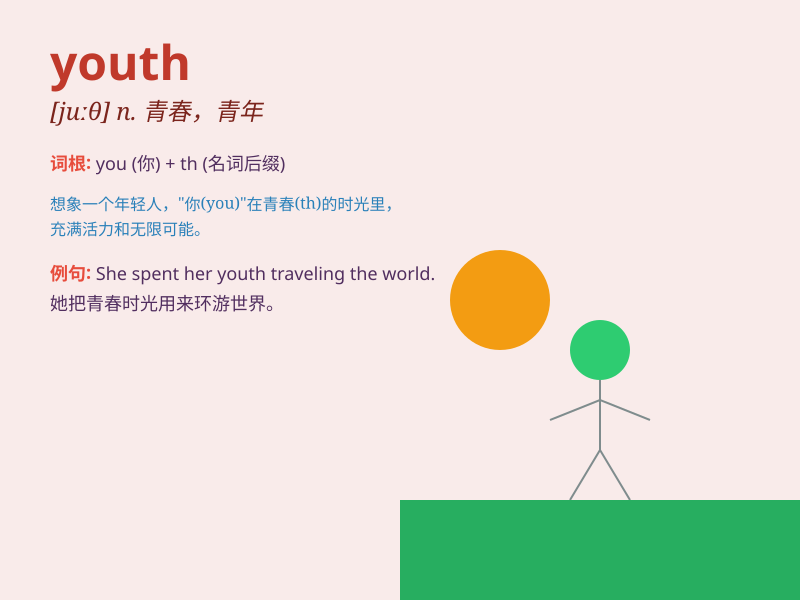

## youth

**英音:** _[juːθ]_ **美音:** _[jʊθ]_

**译义:** *n.青春,青年时期,初期,少年,青年们*

### 短语

+ **youth hostel:** _青年旅社_

+ **youth culture:** _青年文化_

+ **youth unemployment:** _青年失业_

+ **youth movement:** _青年运动_

+ **youth club:** _青年俱乐部_

### 例句

#### 例句1

> **The youth of today have many opportunities.**

**中文翻译:** 现今的年轻人有很多机会。

**单词释义:** 年轻人

#### 例句2

> **He spent his youth in the countryside.**

**中文翻译:** 他在农村度过了他的青年时期。

**单词释义:** 青年时期

#### 例句3

> **The organization aims to help the youth develop their skills.**

**中文翻译:** 这个组织旨在帮助年轻人发展他们的技能。

**单词释义:** 年轻人

### 背诵小故事

> A young boy named Tom was full of energy and dreams. His passion and
curiosity during this period represent the essence of \'youth\'. He
explored the world, facing challenges with courage, showing the vigor
and potential of youth.

**一个叫汤姆的年轻男孩充满活力和梦想。他在此期间的热情和好奇心代表了'youth（青春；青年时期）'的本质。他探索世界，勇敢面对挑战，展现了青春的活力和潜力。**

### 图义

