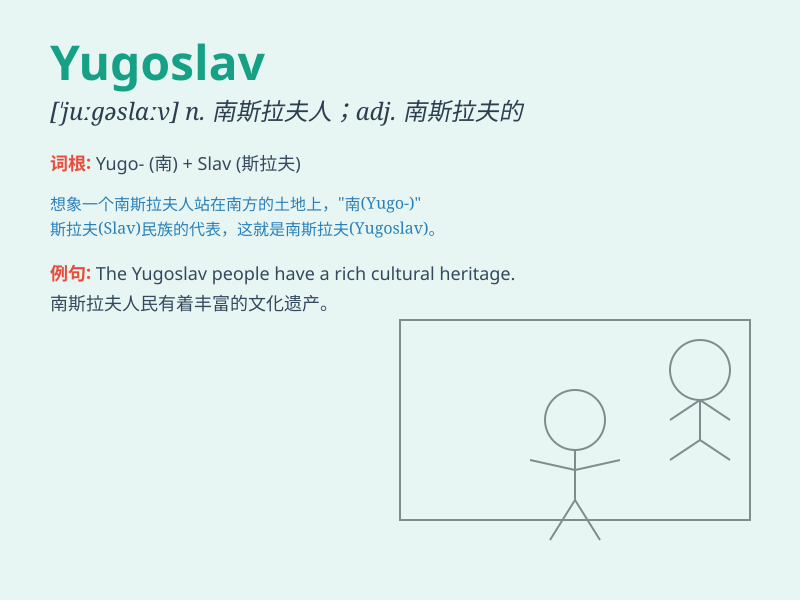

## Yugoslav

**英音:** _[juːɡəʊslɑːv]_ **美音:** _[juːɡoʊslɑːv]_

**译义:**
*n.南斯拉夫（前南斯拉夫社会主义联邦共和国的简称，现已解体）*

### 短语

+ **Yugoslav Republic:** _南斯拉夫共和国_

+ **Yugoslav War:** _南斯拉夫战争_

+ **Yugoslav People:** _南斯拉夫人_

+ **Yugoslav History:** _南斯拉夫历史_

+ **Yugoslav Army:** _南斯拉夫军队_

### 例句

#### 例句1

> **The Yugoslav government faced many challenges in the 1990s.**

**中文翻译:** 南斯拉夫政府在 20 世纪 90 年代面临许多挑战。

**单词释义:** 南斯拉夫的

#### 例句2

> **He is an expert on Yugoslav history.**

**中文翻译:** 他是南斯拉夫历史方面的专家。

**单词释义:** 南斯拉夫的

#### 例句3

> **The Yugoslav war had a profound impact on the region.**

**中文翻译:** 南斯拉夫战争对该地区产生了深远的影响。

**单词释义:** 南斯拉夫的

### 背诵小故事

> Imagine a brave traveler journeying through the lands of Yugoslav. He
meets friendly people, sees beautiful mountains and experiences unique
cultures. The name Yugoslav sticks in his mind as a symbol of adventure
and discovery.

**想象一位勇敢的旅行者在南斯拉夫的土地上旅行。他遇到了友好的人们，看到了美丽的山脉，体验了独特的文化。南斯拉夫这个名字留在他的脑海中，成为冒险和发现的象征。**

### 图义

