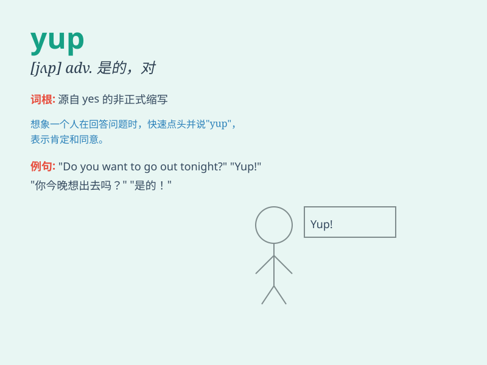

## yup

**英音:** _[jʌp]_ **美音:** _[jʌp]_

**译义:** *int.\<美俚> 是,是的(肯定答复)*

### 短语

+ **yup sure:** _是的，当然_

+ **yup indeed:** _是的，确实_

+ **yup okay:** _好的，行_

+ **yup right:** _对的，没错_

+ **yup correct:** _是的，正确_

### 例句

#### 例句1

> **Yup, I\'m ready to go.**

**中文翻译:** 是的，我准备好出发了。

**单词释义:** 是的（表示肯定、同意）

#### 例句2

> **A: Do you like this movie? B: Yup.**

**中文翻译:** A: 你喜欢这部电影吗？ B: 喜欢。

**单词释义:** 是（用于回答问题，表示肯定）

#### 例句3

> **Yup, that\'s exactly what I thought.**

**中文翻译:** 是的，那正是我所想的。

**单词释义:** 是的（表示认同对方的观点）

### 背诵小故事

> One day, when Tom was asked if he wanted to go for a picnic, he
excitedly replied \'Yup!\' It was a simple but enthusiastic response
that showed his eagerness. From then on, whenever Tom agreed happily, he
would say \'Yup\'.

**有一天，当汤姆被问到是否想去野餐时，他兴奋地回答"yup！"
这是一个简单但充满热情的回答，显示了他的渴望。从那以后，每当汤姆开心地同意时，他都会说"yup"。**

### 图义

