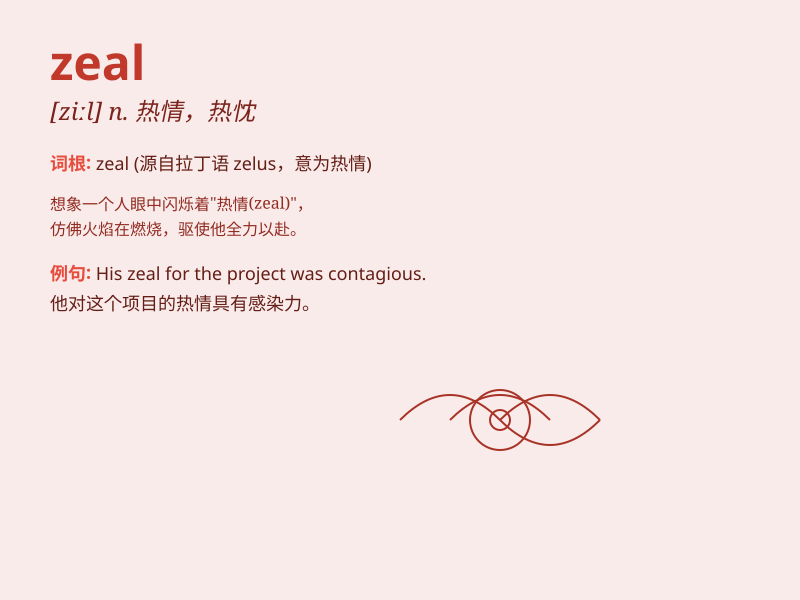

## zeal

**英音:** _[ziːl]_ **美音:** _[zil]_

**译义:** *n.热心,热情,热诚*

### 短语

+ **zeal for:** _对\...的热情_

+ **with zeal:** _热情地_

+ **zeal in doing sth:** _做某事的热情_

+ **ardent zeal:** _炽热的热情_

+ **religious zeal:** _宗教热情_

### 例句

#### 例句1

> **She approached the task with great zeal.**

**中文翻译:** 她满怀热情地着手这项任务。

**单词释义:** 热情

#### 例句2

> **His zeal for learning new languages is remarkable.**

**中文翻译:** 他学习新语言的热情非常显著。

**单词释义:** 热情

#### 例句3

> **The young athlete competed with zeal and determination.**

**中文翻译:** 这位年轻的运动员带着热情和决心参加比赛。

**单词释义:** 热情

### 背诵小故事

> A young artist had a great zeal for painting. He spent hours every
day, filled with passion and energy. His zeal made him keep improving
and finally his works were widely praised.

**一位年轻的艺术家对绘画充满热情。他每天都花费数小时，充满激情和活力。他的热忱使他不断进步，最终他的作品广受赞誉。**

### 图义

