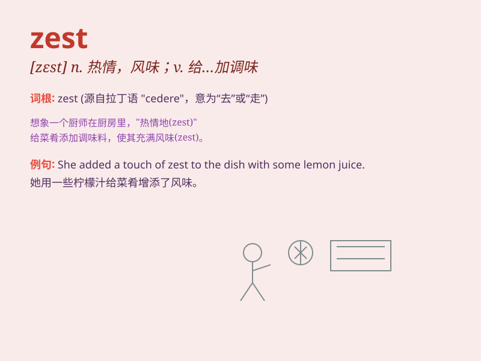

## zest

**英音:** _[zest]_ **美音:** _[zɛst]_

**译义:** *n.风味,强烈的兴趣,热情,热心vt.给\...调味*

### 短语

+ **zest for life:** _对生活的热情_

+ **add zest:** _增添趣味_

+ **with zest:** _充满热情地_

+ **zest of lemon:** _柠檬皮屑_

+ **zest of orange:** _橙皮屑_

### 例句

#### 例句1

> **She approached her work with great zest.**

**中文翻译:** 她满怀热情地投入工作。

**单词释义:** 热情；兴趣

#### 例句2

> **The zest of the lemon adds flavor to the cake.**

**中文翻译:** 柠檬皮给蛋糕增添了风味。

**单词释义:** （水果的）皮；香味

#### 例句3

> **His zest for life is infectious.**

**中文翻译:** 他对生活的热情富有感染力。

**单词释义:** 热情；热忱

### 背诵小故事

>
有一天，小明参加烹饪比赛，他往菜里加入了一种神秘的调料，瞬间让菜品充满了独特的风味，这种调料就是\'zest\'------热情和风味。小明凭借这道菜赢得了比赛，因为\'zest\'让他的菜与众不同。

**有一天，小明参加烹饪比赛，他往菜里加入了一种被称为"热情和风味"的神秘调料"zest"，瞬间让菜品充满独特风味，小明借此赢得比赛，因为"zest"让菜与众不同。**

### 图义

