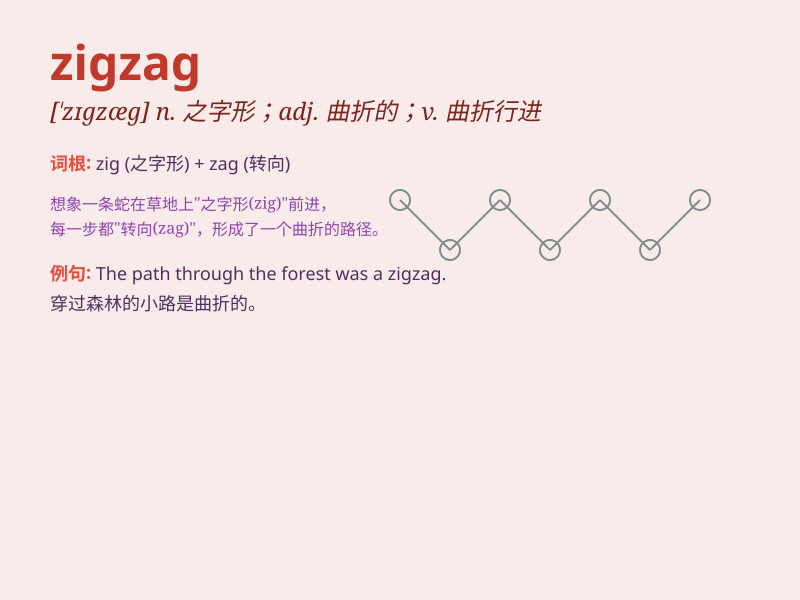

## zigzag

**英音:** _[\'zɪgzæg]_ **美音:** _[\'zɪɡzæɡ]_

**译义:**
*n.Z字形,锯齿形,蜿蜒曲折adj.曲折的,锯齿形的,Z字形的adv.作Z字形地,弯弯曲曲地v.成Z字形,作Z字形行进,曲折前进*

### 短语

+ **zigzag road:** _曲折的道路_

+ **zigzag pattern:** _之字形图案_

+ **zigzag movement:** _曲折的运动_

+ **zigzag line:** _之字线_

+ **zigzag stitch:** _锯齿形针脚_

### 例句

#### 例句1

> **The road zigzagged through the mountains.**

**中文翻译:** 这条路在山间蜿蜒曲折。

**单词释义:** 蜿蜒曲折地行进

#### 例句2

> **The lightning zigzagged across the sky.**

**中文翻译:** 闪电在天空中曲折划过。

**单词释义:** 曲折地移动

#### 例句3

> **She drew a zigzag line on the paper.**

**中文翻译:** 她在纸上画了一条之字形的线。

**单词释义:** 之字形的

### 背诵小故事

> One day, a little ant was walking on a path. The path was not
straight but went up and down like a \'zigzag\'. The ant had to change
its direction many times to follow the path. Finally, it reached its
destination.

**一天，一只小蚂蚁在一条小路上行走。这条路不是笔直的，而是像'之字形'一样上下起伏。蚂蚁不得不多次改变方向来沿着这条路走。最后，它到达了目的地。**

### 图义

