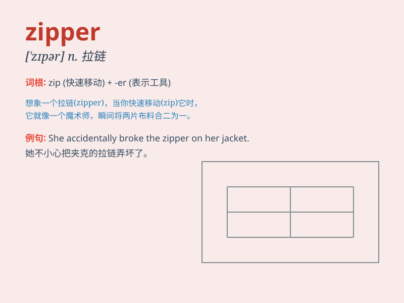

## zipper

**英音:** _[\'zɪpə]_ **美音:** _[ˈzɪpə]_

**译义:** *n.拉练*

### 短语

+ **zipper pocket:** _拉链口袋_

+ **metal zipper:** _金属拉链_

+ **plastic zipper:** _塑料拉链_

+ **zipper closure:** _拉链封口_

+ **broken zipper:** _坏了的拉链_

### 例句

#### 例句1

> **The zipper on my jacket is broken.**

**中文翻译:** 我夹克上的拉链坏了。

**单词释义:** 拉链

#### 例句2

> **She pulled the zipper of her dress up.**

**中文翻译:** 她把连衣裙的拉链拉上了。

**单词释义:** 拉链

#### 例句3

> **The zipper makes it easy to open and close the bag.**

**中文翻译:** 拉链使得这个包容易开合。

**单词释义:** 拉链

### 背诵小故事

> One day, Tom\'s pants zipper broke. He was in a hurry because he had
an important meeting. Luckily, he found a tailor who fixed the zipper
quickly. Tom was relieved and thanked the tailor.

**一天，汤姆的裤子拉链坏了。他很着急，因为他有一个重要的会议。幸运的是，他找到了一个裁缝，很快就修好了拉链。汤姆松了一口气，并感谢了裁缝。**

### 图义

