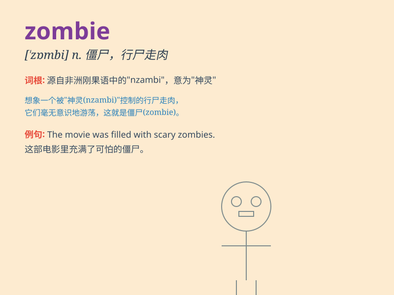

## zombie

**英音:** _[\'zɒmbɪ]_ **美音:** _[\'zɑmbi]_

**译义:** *n.巫毒崇拜,蛇神,生性怪癖的人*

### 短语

+ **zombie movie:** _僵尸电影_

+ **zombie apocalypse:** _僵尸末日_

+ **zombie virus:** _僵尸病毒_

+ **zombie walk:** _僵尸游行_

+ **zombie attack:** _僵尸攻击_

### 例句

#### 例句1

> **The zombie shambled slowly towards the survivors.**

**中文翻译:** 这个僵尸缓慢地朝幸存者蹒跚而去。

**单词释义:** 僵尸

#### 例句2

> **She felt like a zombie after pulling an all-nighter.**

**中文翻译:** 她熬了个通宵后感觉自己像个行尸走肉。

**单词释义:** 行尸走肉；无精打采的人

#### 例句3

> **The movie was full of terrifying zombies.**

**中文翻译:** 这部电影里到处都是可怕的僵尸。

**单词释义:** 僵尸

### 背诵小故事

> A scientist was conducting experiments in a secret lab. One night, a
mistake happened and a dead body turned into a zombie. It started
chasing everyone, scaring them to death. Remember, zombie means a
walking dead creature!

**一位科学家在一个秘密实验室做实验。一天晚上，出了差错，一具尸体变成了僵尸。它开始追逐每个人，把他们吓得要死。记住，zombie
意思是僵尸，行尸走肉！**

### 图义

