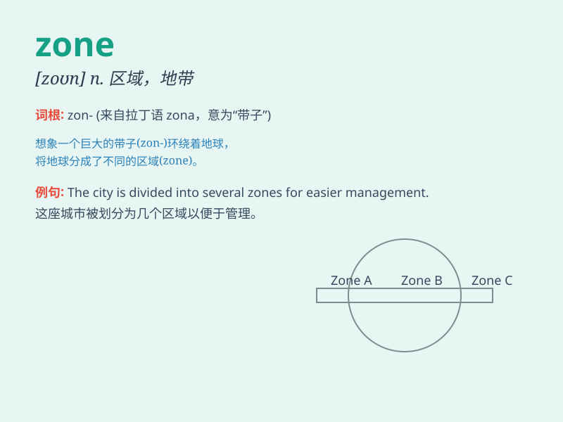

## zone

**英音:** _[zəʊn]_ **美音:** _[zon]_

**译义:** *n.地域,地带,地区,环带,圈vt.环绕,使分成地带vi.分成区*

### 短语

+ **time zone:** _时区_

+ **war zone:** _战区_

+ **safety zone:** _安全区_

+ **combat zone:** _作战区域_

+ **buffer zone:** _缓冲区_

### 例句

#### 例句1

> **The city is divided into several commercial zones.**

**中文翻译:** 这座城市被划分成了几个商业区。

**单词释义:** 区域；地带

#### 例句2

> **The soldiers were sent to the war zone.**

**中文翻译:** 士兵们被派往了战区。

**单词释义:** 地区；战区

#### 例句3

> **She is in her comfort zone when reading books at home.**

**中文翻译:** 她在家读书时处于舒适区。

**单词释义:** （心理上的）舒适区

### 背诵小故事

> Once upon a time, a brave explorer was lost in a strange place. But
he found a map marked with different \'zones\'. Each zone had its own
features. Finally, he used the map to find his way out.

**从前，有一位勇敢的探险家在一个陌生的地方迷路了。但他发现了一张标有不同"区域"的地图。每个区域都有自己的特点。最后，他用这张地图找到了出路。**

### 图义

