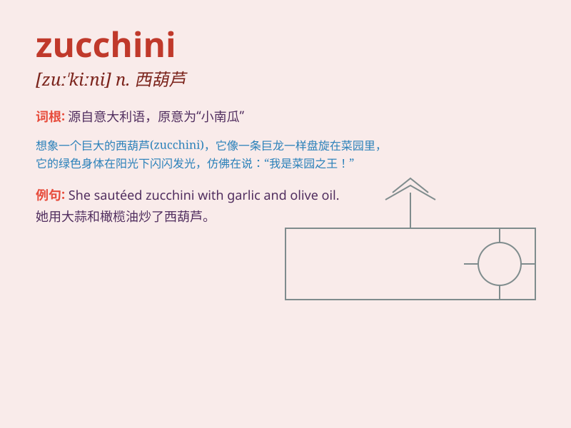

## zucchini

**英音:** _[zʊ\'kiːnɪ]_ **美音:** _[zu\'kini]_

**译义:** *n.夏季产南瓜之一种*

### 短语

+ **zucchini bread:** _西葫芦面包_

+ **zucchini noodles:** _西葫芦面条_

+ **grilled zucchini:** _烤西葫芦_

+ **stuffed zucchini:** _酿西葫芦_

+ **zucchini fritters:** _西葫芦煎饼_

### 例句

#### 例句1

> **I love adding zucchini to my stir-fry dishes.**

**中文翻译:** 我喜欢在炒菜中加入西葫芦。

**单词释义:** 西葫芦（一种蔬菜）

#### 例句2

> **The zucchini in the garden are growing well.**

**中文翻译:** 花园里的西葫芦长得很好。

**单词释义:** 西葫芦

#### 例句3

> **She made a delicious zucchini bread.**

**中文翻译:** 她做了美味的西葫芦面包。

**单词释义:** 西葫芦

### 背诵小故事

> One day, a little girl went to the farm and saw a strange green
vegetable. Her mother told her it was a zucchini. The girl was curious
and remembered it because of its unique shape and name.

**有一天，一个小女孩去农场看到了一种奇怪的绿色蔬菜。她妈妈告诉她这是西葫芦。小女孩很好奇，并因为它独特的形状和名字记住了它。**

### 图义

